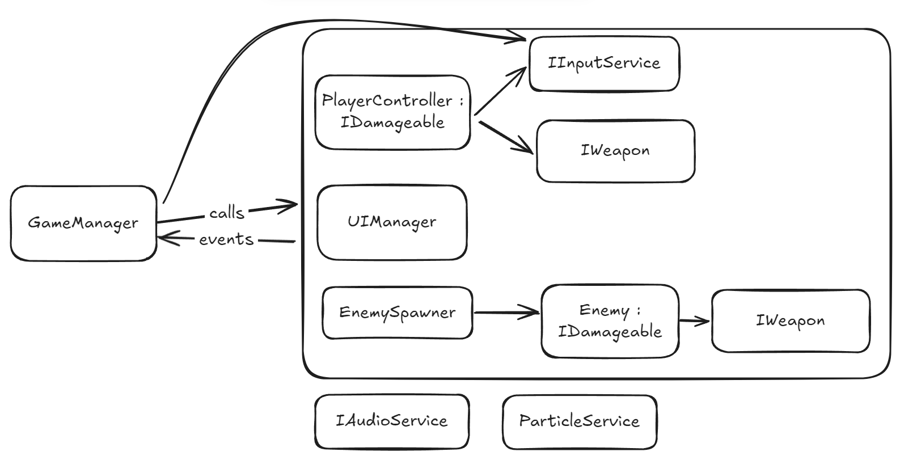

Prototype of basic twin stick shooter.

Simplified architecture diagram

GameManager uses PlayerController, UIManager and EnemySpawner via calls.
All those are injected into GameManager by Zenject.

GameManager listens to events from these classes, f.e. player's death, and then can update UI and restart the game.

Health bar for player is an example of MVP, using classes HealthComponent and HealthPresenter.

IAudioService made abstract and hides FMOD implementation behind interface, so it can be changed to f.e. Wwise or Unity Core Audio easily. 
IAudioService and ParticleService can be accessed from various classes, so it appears on the bottom of the diagram.

Enemies and Particles is example of object pooling
